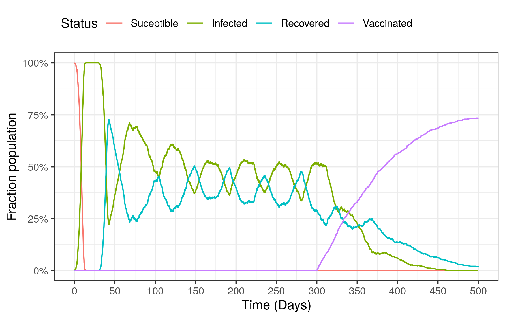
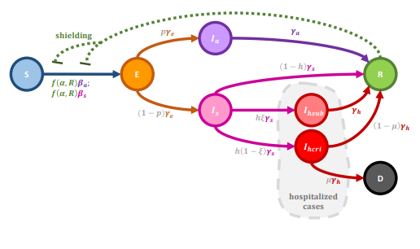
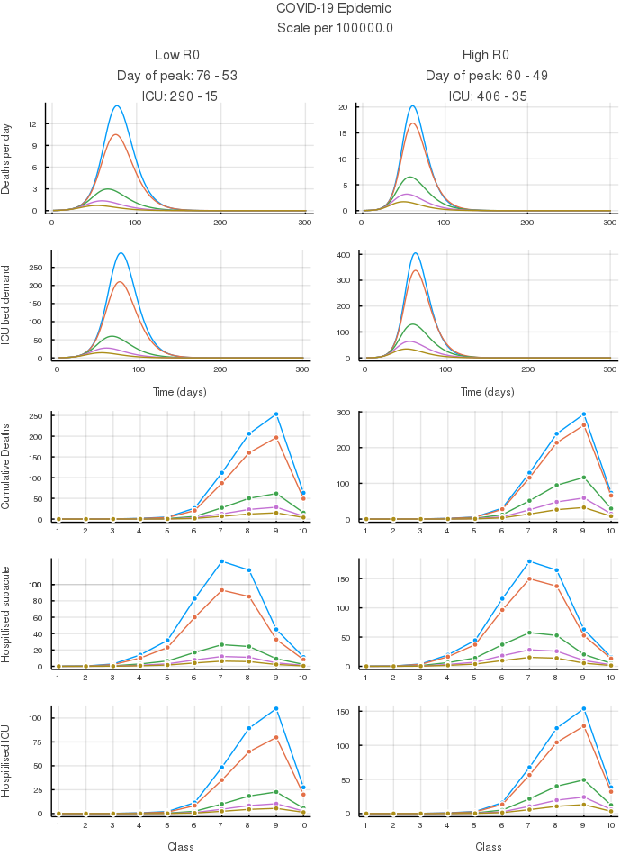

# Biomath in times of Coronavirus

Since the outbreak of the coronavirus disease 19 (COVID-19), many mathematical models have been proposed, various of which several governments had used to implement their policy to lockdown the population. In particular, Mexico City has posed for an ordinary differential equations model to keep the spread of the virus under control. But, no optimal span of the lockdown was proposed, and therefore, the city is in an indefinite quarantine, affecting the economy of the whole country. Here we assess different aspects of the coronavirus epidemic in Mexico City, studying the dynamics in response to different spans and intensities of the lockdown, performing simulations using the ordinary differenltial equations model proposed by the government of Mexico City, and a new individual agent-based model that takes into account hygiene measures of individuals.

## Examples of models
### ABM - Periodic lockdown with vaccination

### ODE - Shield Immunity

#### Scheme

#### Epidemic differences depending on the severity of sanitary measures.

